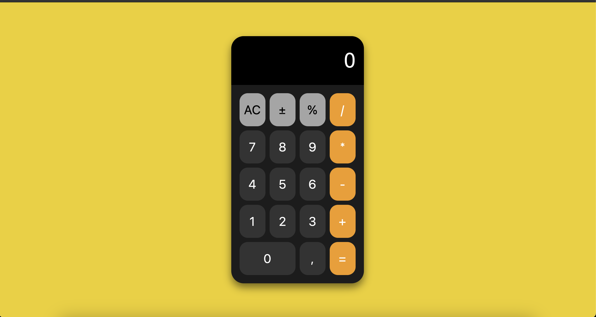

# Описание калькулятора

Этот калькулятор представляет собой простой и удобный инструмент для выполнения базовых арифметических операций. Интерфейс калькулятора интуитивно понятен и включает стандартные функции, необходимые для ежедневных расчетов.

## Возможности калькулятора:

### 1. Базовые арифметические операции:

- **Сложение (+)**: Позволяет складывать два числа.
- **Вычитание (-)**: Используется для вычитания одного числа из другого.
- **Умножение (\*)**: Перемножает два числа.
- **Деление (/)**: Делит одно число на другое.

### 2. Управление вводом:

- **Очистка (AC)**: Сбрасывает текущий ввод и очищает все предыдущие данные.
- **Смена знака (±)**: Изменяет знак текущего числа (с положительного на отрицательный и наоборот).
- **Процент (%)**: Преобразует текущее число в процентное значение (делит его на 100).
- **Десятичные дроби (,)**: Поддержка работы с десятичными числами через запятую.

### 3. Удобный интерфейс
